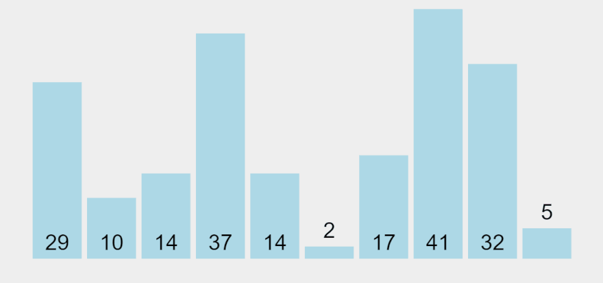

## 선택 정렬

N개이 숫자가 입력되면 오름차순으로 정렬하여 출력하는 프로그램을 작성하세요.

정렬하는 방법은 선택정렬입니다.

### 입력설명

첫 번째 줄에 자연수 N(1<=N<=100)이 주어집니다.

두 번째 줄에 N개의 자연수가 공백을 사이에 두고 입력됩니다.

각 자연수는 정수형 범위 안에 있습니다.

### 출력설명

오름차순으로 정렬된 수열을 출력합니다.

### 입력예제 1

6

```
13 5 11 7 23 15
```

### 출력예제 1

5 7 11 13 15 23

## 정렬 설명

### 소개



주어진 리스트에서 가장 작은 값을 선택하여 맨 앞에 위치시키고,

그다음으로 작은 값을 찾아 두 번째 위치에 위치시키는 과정을 반복하여 정렬하는 알고리즘입니다.

앞으로 보내진 원소는 더 이상 위치가 변경되지 않습니다.

### 기본 개념

선택 정렬은 간단하면서도 이해하기 쉽고 코드 구현이 쉬운 알고리즘이지만,

그만큼 시간 복잡도가 높아 대규모 데이터를 정렬할 때는 성능이 떨어지는 단점이 있습니다.

선택 정렬의 시간 복잡도는 O(N^2)으로, 입력 데이터의 크기가 커질수록 성능 저하가 더욱 심해집니다.

### 과정

1. 배열의 길이를 변수 n에 저장한 뒤, 바깥쪽 for loop에서 i를 0부터 n-2까지 증가시킵니다.
2. 현재 인덱스 i부터 끝까지의 값 중 가장 작은 값을 찾아 i번째 위치에 놓습니다.
3. 이 과정을 n-1번 반복하면 모든 값이 정렬되어 나열됩니다.
