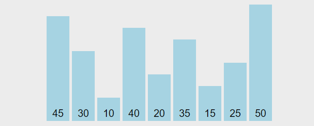

## 버블 정렬

N개이 숫자가 입력되면 오름차순으로 정렬하여 출력하는 프로그램을 작성하세요.

정렬하는 방법은 버블정렬입니다.

### 입력설명

첫 번째 줄에 자연수 N(1<=N<=100)이 주어집니다.

두 번째 줄에 N개의 자연수가 공백을 사이에 두고 입력됩니다.

각 자연수는 정수형 범위 안에 있습니다.

### 출력설명

오름차순으로 정렬된 수열을 출력합니다.

### 입력예제 1

6

```
13 5 11 7 23 15
```

### 출력예제 1

5 7 11 13 15 23

## 정렬 설명

### 소개



버블 정렬(Bubble Sort)은 가장 간단하고 기본적인 알고리즘 중 하나로,

이름에서도 알 수 있듯이 배열의 요소를 '거품(Bubble)'처럼 서로 교환해 가며 정렬하는 방식입니다.

즉, 서로 인접한 두 원소를 비교해가며 오름차순이나 내림차순으로 정을 진행합니다.

### 기본 개념

버블 정렬의 개념은 만약 숫자 배열을 오름차순으로 정렬하는 상황에서 더 큰 숫자가 한 번에 하나씩 뒤로 이동하는 방법입니다.

기본적으로 어떤 항목이 더 크면 교환하고, 다음 항목과 비교하고, 다음 항목보다 더 크면 또 교환을 하고, 다시 다음 항목과 비교하면서 반복을 합니다.

오름차순의 상황에서는 가장 큰 값이 상단을 향해서 값을 정렬하는 방식으로 목록을 만듭니다.

### 시간 복잡도

배열의 각 항목마다 n번의 비교를 하고 배열의 다른 모든 항목 하나하나 비교하기 때문에 일반적으로 버블 정렬의 시간 복잡도는 O(N^2)입니다.

그러나 데이터가 거의 정렬되었거나 이미 정렬이 완료된 상태에서 noSwaps 변수가 있는 코드를 사용하면 선형 시간(Linear Time)에 가까워집니다.

예를 들어, [1, 2, 3, 4, 5]와 같은 이미 오름차순으로 정렬된 배열에서는 첫 번째 패스 동안 어떠한 교환도 발생하지 않아 알고리즘이 즉시 종료됩니다.

따라서 이 경우 버블정렬의 시간 복잡도는 O(N)으로 줄어들게 됩니다.

다만 주목해야 할 점은 이러한 최적화 사항들은 '최선'의 경우에 해당하며 일반적인 상황에서 버블정렬은 여전히 O(N^2)의 시간 복잡도를 가진다는 것입니다.
