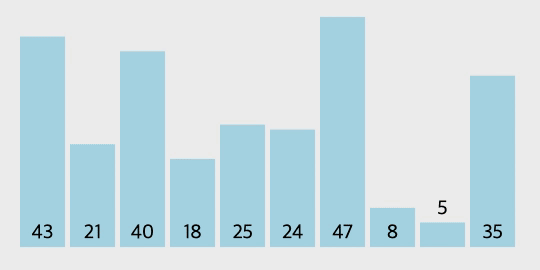

## 삽입 정렬

N개이 숫자가 입력되면 오름차순으로 정렬하여 출력하는 프로그램을 작성하세요.

정렬하는 방법은 삽입정렬입니다.

### 입력설명

첫 번째 줄에 자연수 N(1<=N<=100)이 주어집니다.

두 번째 줄에 N개의 자연수가 공백을 사이에 두고 입력됩니다.

각 자연수는 정수형 범위 안에 있습니다.

### 출력설명

오름차순으로 정렬된 수열을 출력합니다.

### 입력예제 1

6
11 7 5 6 10 9

### 출력예제 1

5 6 7 9 10 11

## 정렬 설명

### 소개

간단하고 직관적인 정렬 알고리즘 중 하나입니다.
 
배열의 원소를 순서대로 탐색하며, 각 원소를 이미 정렬된 배열 부분과 비교하여 적절한 위치에 삽입하는 방식으로 정렬을 진행합니다.
 
대부분의 경우 다른 고급 정렬 알고리즘보다 성능이 떨어지기 때문에 매우 큰 배열이나 시간제한이 있는 경우에는 다른 정렬 알고리즘을 사용하는 것이 좋습니다.

### 과정
1. 배열의 두 번째 원소부터 시작하여, 첫 번째 원소와 비교합니다.
2. 첫 번째 원소보다 작은 경우, 첫 번째 원소와 위치를 교환합니다.
3. 세 번째 원소부터 시작하여, 이미 정렬된 배열 부분에서 자신의 위치를 찾아 삽입합니다.
4. 배열 전체를 탐색하면서 2 ~ 3 단계를 반복합니다.

### 시간 복잡도
삽입 정렬의 시간 복잡도는 O(N^2)입니다.

하지만 배열의 크기가 작은 경우에는 다른 정렬 알고리즘보다 빠를 수 있으며,

이미 정렬된 배열에 대해서는 최선의 경우 O(N)의 시간 복잡도를 가질 수 있습니다.

