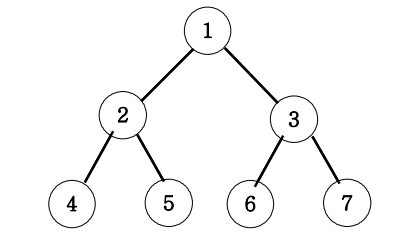

## 이진트리 넓이우선탐색(BFS)

아래 그림과 같은 이진트리를 넓이우선탐색해 보세요.

넓이 우선 탐색 : 1 2 3 4 5 6 7

### 이론
그래프 트리의 레벨 별로 하나씩 넓게 탐색 
(1레벨 탐색, 2레벨 탐색, 3레벨 탐색, 4레벨 탐색)

큐에 들어가서 탐색, 탐색 완료 후 나오면서 연결된 요소들을 push

(주로 최단 경로를 찾는 문제, 네트워킹, 최소 연결 경로)